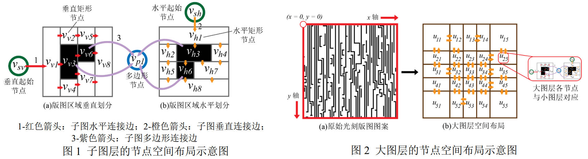
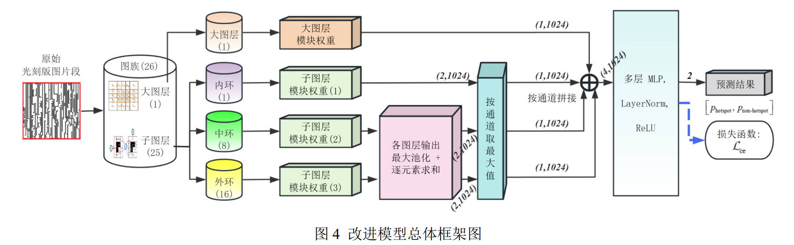
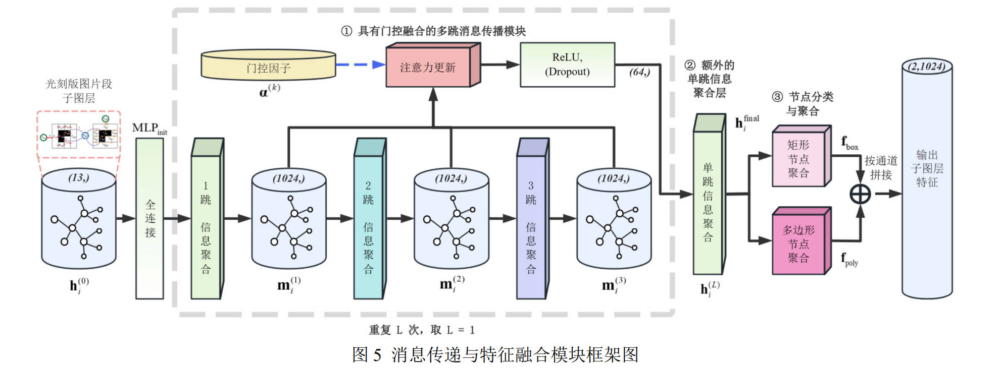
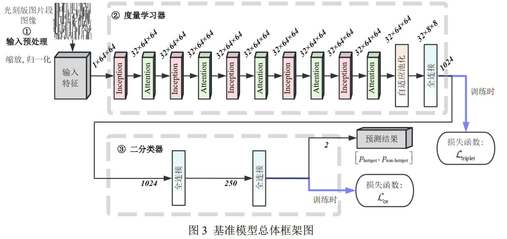

# graph-hotspot-detection
This repository presents my complete undergraduate graduation project (2025) from Guangdong University of Technology (Automation), titled  
**“Research on Lithography Hotspot Detection Algorithm Based on Deep Learning”**, focusing on lithography hotspot detection using deep learning and graph-based methods.

The project includes full documentation, implementation code, and trained model weights, aiming to provide a comprehensive reference for research and engineering practice in computational lithography and EDA.

本仓库展示了我在广东工业大学（自动化）完成的本科毕业设计项目（2025年），项目名称为 **“基于深度学习的光刻热点检测算法研究”**。该项目主要研究基于深度学习和图论的光刻热点检测方法。

项目包含完整的文档、实现代码和训练好的模型权重，旨在为计算光刻和EDA领域的研究和工程实践提供全面的参考。

该项目获得2025届自动化学院自动化专业本科毕业设计创新奖（排名：5/10，专家评审组评分：91/100）。

## 🔍 Overview

Lithography hotspot detection is a critical problem in IC manufacturing. Traditional approaches rely heavily on pattern matching or rule-based methods, which often struggle with generalization.

This project explores a **Graph Neural Network (GNN)-based framework** to model layout patterns and detect hotspots more effectively.

Key features:
- Graph-based layout representation



- Deep learning-driven hotspot classification





- Comparison with prior work (Geng et al., ICCAD 2020)



- Full undergraduate research workflow documentation

## 📁 Repository Structure

```text
.
├── docs/               # Complete academic documents
├── src/
│   ├── comparation/   # Reproduction of prior work (Geng2020)
│   ├── models/        # Trained model weights (.pt)
│   ├── scripts/       # Core implementation (train/test/backbone)
│   └── utils/         # Utility functions
├── checkpoints/       # Additional model checkpoints
├── assets/            # Figures and diagrams for visualization
├── scripts/           # Entry scripts
```

## 📄 Documentation

The `/docs` directory provides a complete set of academic materials from an undergraduate graduation project in a Chinese university. It covers the full lifecycle of the project, from proposal to final evaluation and award application.

All personal information has been removed for public release.

### 📘 Thesis
- `undergraduate_thesis.pdf` （Chinese：毕业论文原文）
- `undergraduate_thesis.docx`

### 🎤 Defense
- `defense_slides.pdf`（Chinese：答辩演示文稿）
- `defense_slides.pptx`
- `defense_record.pdf`（Chinese：答辩记录表）
- `defense_record.docx`

### 📝 Reports
- `proposal_report.pdf`（Chinese：开题报告书）
- `proposal_report.docx`
- `midterm_report.pdf`（Chinese：中期检查表）
- `midterm_report.docx`

### 🏆 Awards
- `innovation_award_application.pdf`（Chinese：毕业论文创新奖申请表）
- `innovation_award_application.docx`
- `innovation_award_brief.pdf`（Chinese：毕业论文创新奖“小作文”）
- `innovation_award_brief.docx`

### 📑 Evaluation
- `evaluation_form.pdf`（Chinese：毕业论文评阅表）
- `evaluation_form.docx`

### 📋 Supervision Records
- `supervision_record.pdf`（Chinese：导师指导记录）
- `supervision_record.docx`

### 📎 Appendix
- `appendix_I.pdf`（Chinese：“附表 I”）
- `appendix_I.docx`

Note: "appendix_I" is used to illustrate the positive significance of the graduation project's solution in social responsibility, engineering management, and economic decision-making.

💡 These materials may be useful for:
- Understanding the structure of undergraduate thesis projects in Chinese universities  
- Reference for academic writing and documentation standards  
- Educational and research purposes in engineering disciplines

## 🧠 Method

The proposed method models IC layout patterns using graph structures and applies deep learning techniques for classification.

Highlights:

- Structured representation of layout geometry
- GNN-based feature extraction
- End-to-end hotspot detection pipeline
- Comparative study with baseline methods

## 📊 Dataset

The dataset is not included in this repository due to size constraints.

You can obtain it from:
👉 <https://github.com/Intelectron6/Lithography-Hotspot-Detection>

## 🚀 Usage

### 1. Training

Source file located at: `src/scripts/Train.py`

### 2. Testing

Source file located at: `src/scripts/Test.py`

## 📦 Model Weights

Pretrained model weights are provided in:

```
src/models/
```

## 📚 Reference

If you are interested in the baseline method:

- Hao Geng, Haoyu Yang, Lu Zhang, Jin Miao, Fan Yang, Xuan Zeng, and Bei Yu. 2020. Hotspot detection via attention-based deep layout metric learning. In Proceedings of the 39th International Conference on Computer-Aided Design (ICCAD '20). Association for Computing Machinery, New York, NY, USA, Article 16, 1–8. https://doi.org/10.1145/3400302.3415661 

## 🏆 Acknowledgement

This work received the **Outstanding Innovation Award** for undergraduate graduation design at Guangdong University of Technology.

The research results have been published in the following journal:

- Liang, L., Cai, S., & Zhang, H. (2025). Hotspot detection algorithm based on graph-family modeling and graph neural networks. *Journal of Guangdong University of Technology*, 42(6), 34–43. https://doi.org/10.12052/gdutxb.250111

## ⚠️ Disclaimer

This repository is intended for academic and educational purposes only.

## 📬 Contact

If you find this project helpful, feel free to open an issue or contact me.
